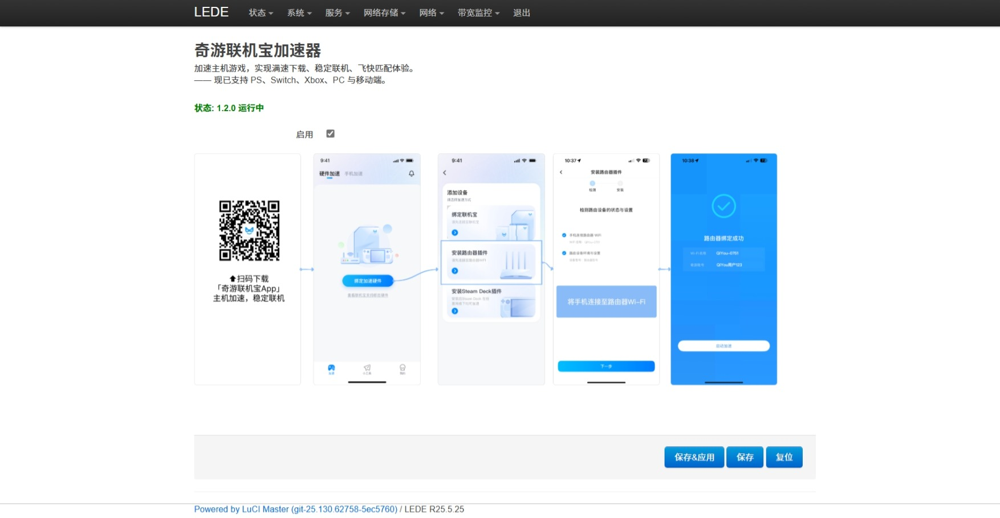

# LuCI-app-QiYouGameBooster(奇游联机宝)

加速主机游戏，实现满速下载、稳定联机、飞快匹配体验。—— 现已支持 PS、Switch、Xbox、PC 与移动端。

### [Lean's LEDE](https://github.com/coolsnowwolf/lede) 现已上线该插件,可直接``make menuconfig``编译使用

## 如何添加到OpenWrt/LEDE中?

### 1.使用``git clone``克隆到源码中:
```bash
git clone https://github.com/qiyouacc/qy-coolsnowwolf.git package/qiyougamebooster
```

#### 在配置菜单中添加奇游加速器:
```bash
make menuconfig
```
#### 在``LuCI -> Applications``勾选``luci-app-qiyougamebooster``,选择``Save``保存并选择``Exit``退出即可。

---
### 当前分支仅支持LuCI2(OpenWrt21.02-24.10), 如要在LuCI(OpenWrt-18.06)上使用，请前往lua分支或[点击这里](https://github.com/qiyouacc/qy-coolsnowwolf/tree/lua)

## 使用效果

